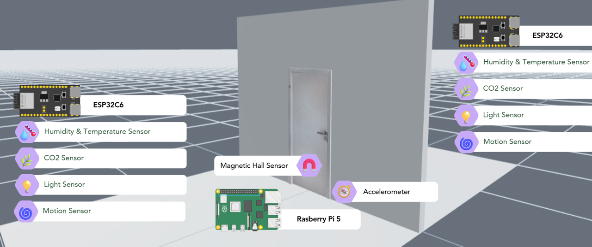
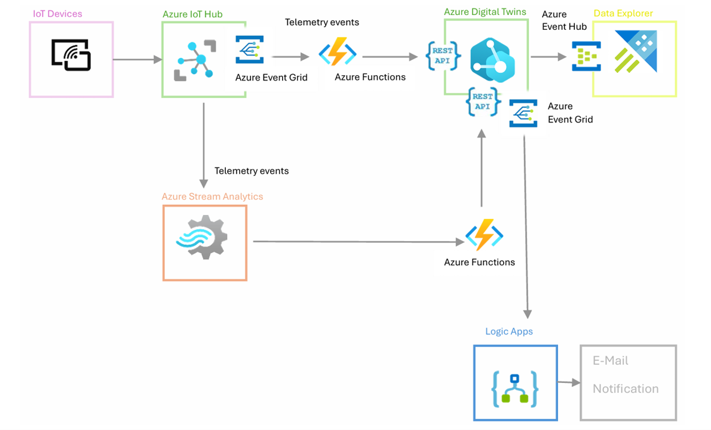

# Analysis of Digital Twins Implementations in Major IoT Cloud Providers  
 
## Project Overview 
This thesis explores the implementation of digital twins in the cloud of two major cloud providers: Microsoft Azure and Amazon Web Services (AWS). The research is focused on real-time data processing, state management, and anomaly detection. A prototype, a digital twin of a door and two rooms, was implemented in order to explore the capabilities of the two cloud providers. Both cloud providers proved to offer well rounded digital twin solutions. However, there is no out-of-the-box solution. The cloud providers excel at offering flexible solutions with modular services, so that any requirements that one might have for a digital twin can be fulfilled. AWS stood out with a more straightforward implementation process, while Azure offered easier dashboard configuration. Performance differences, such as latency were found to depend more on architectural decisions than on the platforms themselves. The results demonstrate that successful digital twin projects rely more on thoughtful system design than on the choice of cloud provider. Although not all features, like edge computing or machine learning integration, were implemented in the prototype, this research still discusses various topics such as conflict resolution and the handling of offline phases. 
 
--- 
 
## 🎥 Short Video 
A short video of the prototype in action is available here: [link to your video]. 
 
--- 
## Prototype 
 
The prototype represents a **door connecting two rooms**, equipped with IoT sensors to capture real-world activity and environmental data.   
 
- **Sensors used**:   
  - CO₂ sensor (air quality)   
  - PIR motion sensor (occupancy)   
  - Light and humidity sensors (environmental monitoring)   
  - Magnetic/Hall sensor & accelerometer (door state, open/closed, slammed)   
 
- **Devices**:   
  - **ESP32** microcontrollers to capture sensor data and publish it via MQTT.   
  - **Raspberry Pi** gateway to forward data and handle local buffering.   
 
This setup allowed the digital twins on **Azure** and **AWS** to model the physical state of the door and rooms, detect anomalies (e.g., door slammed, conflicting sensor data and abnormal CO2 readings), and trigger email alerts in real time. 
 
 
### Prototype Overview 
   
Diagram showing the setup of the prototype. 
 
--- 
 
## 📊 Visuals & Diagrams 
 
### Architecture on Azure 
   
Azure Architecture including Azure IoTHub, Stream Analytics, Digital Twin, Functions, Logic App and DataExplorer. 
 
--- 
 
### Architecture on AWS 
   
AWS Architecture including IoT Core, Step Functions, Lambda Functions, Timestream, SNS, TwinMaker, S3 and Grafana. 
 
--- 
 
### Devices 
   
   
ESP32 device used to capture sensor data in both rooms. 
 
--- 
 
   
   
Raspberry Pi acting as gateway sending data to the cloud. 
 
--- 
 
### UML Diagram 
   
This diagram shows the organisation of the code on the Raspberry Pi and ESP32 C6. 
 
---
